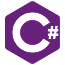

### Hi there 👋

I am an final yaer researcher (pursuing PhD) deeply devoted and highly passionate about science. I strive for excellence and contribution to knowledge. I am a curious 
person, hungry for knowledge, as my never-ending education demonstrates. Since I  started my undergraduate studies, my interests have always turned around <strong>Artificial Intelligence</strong> and <strong>innovative applications</strong> especially applied to formal reasoning and the World Wide Web.  I am a part-time lecturer and demonstrator, covering both bachelors and masters courses in Computer Science and I am an active member of a team of post-graduated talented individuals working in Music Tech with Artificial Intelligence. 

I have 5 peer-reviewed publications including a journal in Nature. I had been working with signal processing, machine and deep learning techniques, especially with time-series data. Experienced working with hardware and sensors with Arduino and Raspberry Pi. I had been working on pose estimation and finding rhythm from video data. I have created several interfaces for creative music-making.

### 🧰 Toolbox
 
  
  
  
 
 
 

- If you want to see my portfolio: https://sutirthachakraborty.github.io/Official/

 

 

 

  

)  
 
)
)

 
